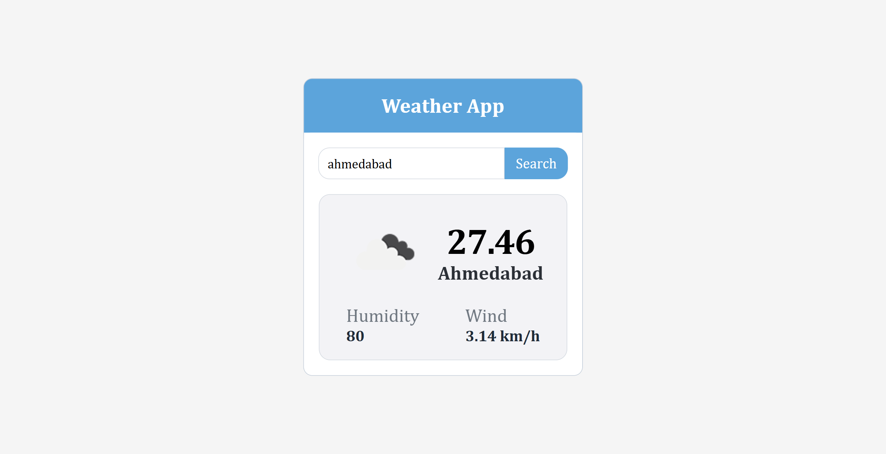
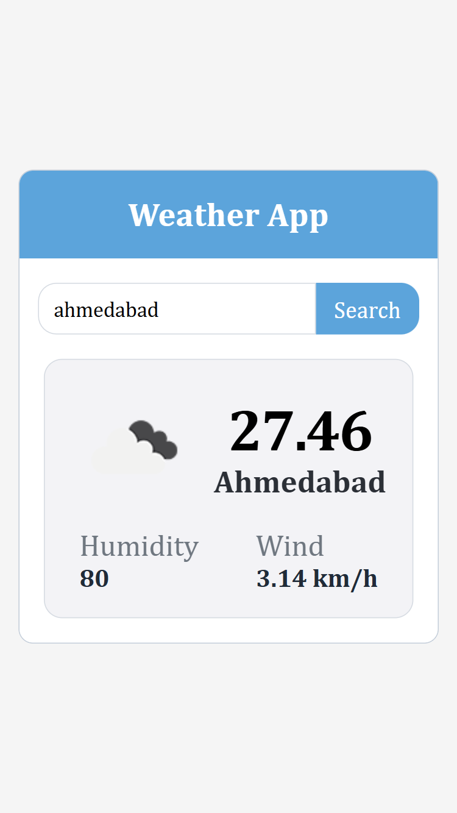

<!--
███████╗███████╗███████╗██╗     
██╔════╝██╔════╝██╔════╝██║     
█████╗  █████╗  █████╗  ██║     
██╔══╝  ██╔══╝  ██╔══╝  ██║     
███████╗███████╗██║     ███████╗
╚══════╝╚══════╝╚═╝     ╚══════╝
     Z E E L   P A N C H A L 🚀
-->

---

<h1 align="center">🌦️ Weather App</h1>

A clean and responsive Weather App built using **HTML**, **CSS**, and **Vanilla JavaScript**. Enter any city name and get real-time weather details like temperature, humidity, wind speed, and weather icons, all powered by the OpenWeatherMap API.

---

## 🔗 Live Demo

👉 [View Project on GitHub Pages](https://panchal-zeel.github.io/weather-app-zp/)  
_Or clone and run locally using Live Server._

---

## 📸 Project Screenshots

### 💻 Desktop View  


### 📱 Mobile View  


---

## 🚀 Features

- 🔍 Enter any city name to fetch weather
- 🌡 Shows **temperature**, **humidity**, and **wind speed**
- ☁️ Displays relevant **weather icons**
- 🧠 Uses **OpenWeatherMap API** to fetch real-time data
- ✅ Responsive UI for all screen sizes
- ⚡ Instant UI updates upon search

---

## 🛠️ Tech Stack

| Tech         | Purpose                                |
|--------------|----------------------------------------|
| HTML         | Page structure                         |
| CSS          | Styling and layout                     |
| JavaScript   | API calls and interactivity            |
| OpenWeather  | Real-time weather data                 |

---

## 🧪 How to Use

1. Type a **city name** into the input field
2. Click the **Search** button
3. View weather details like:
   - Temperature
   - City Name
   - Weather Icon
   - Humidity
   - Wind Speed

---

## 📁 Project Structure

```
📦 Weather App/
├── index.html # Main HTML file
├── style.css # All custom CSS
├── script.js # JavaScript logic
├── manifest.json # (For Chrome Extension use)
├── icons/ # Weather or extension icons
├── previews/ # Screenshots for README
└── README.md # Project overview

```

## 👨‍💻 Author

**Zeel Panchal**    
[GitHub Profile](https://github.com/Panchal-Zeel/)

---
